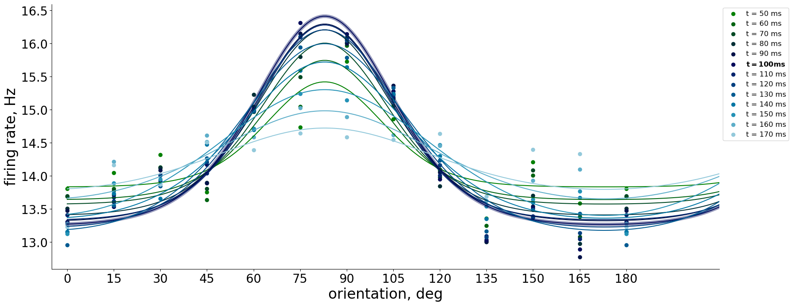

# 🧠 Reverse Correlation and Orientation Tuning in V1  
**Simulations and model fitting using Poisson spike data and tuning curve analysis**  
By [Anna Kryshtal](https://github.com/annkryshtal)

---

## 🧬 Project Overview

This repository contains simulation and modeling code developed for my MSc Neuroscience thesis. The goal is to understand how populations of neurons in the primary visual cortex (V1) encode orientation and contrast information through reverse correlation and tuning curve analysis.

Using synthetic spiking data (homogeneous and inhomogeneous Poisson processes), I reconstruct reverse correlation kernels and apply model fitting (von Mises and wrapped Gaussian) to explore tuning properties and contrast invariance.

---

## 📂 Repository Contents

| File | Description |
|------|-------------|
| `Tuning_Curves_and_Spiking_Process_Simulation.ipynb` | Main notebook integrating reverse correlation data, model fitting, and contrast analysis. |
| `Simulated_kernels_homogeneous_spiking.ipynb` | Simulates **homogeneous** Poisson spiking and reconstructs revcorr kernels from noise stimuli. |
| `Simulated_kernels_inhomogeneous_spiking.ipynb` | Simulates **inhomogeneous** Poisson spiking to mimic time-varying neural activity. |
| `functions_for_fitting_updated.py` | Orientation tuning curve models and shared-parameter multi-curve fitting (von Mises & Gaussian). Includes statistical fit comparisons and OSI/tuning width calculations. |
| `functions_for_contr_invariance.py` | Contrast invariance metrics (e.g., gain functions over time and contrast levels). |
| `1st_fitting_approach_fitting_average.py` | Prototype script for fitting average responses. Retained for methodological context. |

---

## 🛠 Dependencies

This code uses:

- `numpy`, `pandas`, `scipy`, `matplotlib`, `seaborn`
- `lmfit` for multi-parameter fitting
- `statsmodels`, `adjustText`, `mycolorpy`

## ⚠️ Notes on Lab-Specific Code
Some parts of functions_for_fitting_updated.py use internal modules from a DataJoint-based codebase (`djd.*`, e.g., `djd.revcorr`, `djd.unit`, `djd.tuning`, etc.).
These are not included in this repository. They are used only for experiment-specific data access. All model functions, tuning curve fitting, and simulation logic are self-contained and reusable.

To run the code independently:
Comment out or replace `djd.*` imports.

## 📊 Sample Output
This figure demonstrates orientation tuning curve fitting using a von Mises function, generated with functions from `functions_for_fitting_updated.py`.
### Orientation Tuning Curve Fit

## 👩‍🔬 Academic Context
This work was conducted during my MSc Neuroscience thesis in the Busse Lab at LMU Munich. It builds on research exploring how V1 neurons encode visual stimuli through tuning curve properties and gain modulation.
All data in this repository is either simulated or formatted for public sharing. For academic reuse or adaptation, please cite the repository or contact me directly.

## 📜 License
MIT License – free for academic and non-commercial use. See LICENSE file for details.
